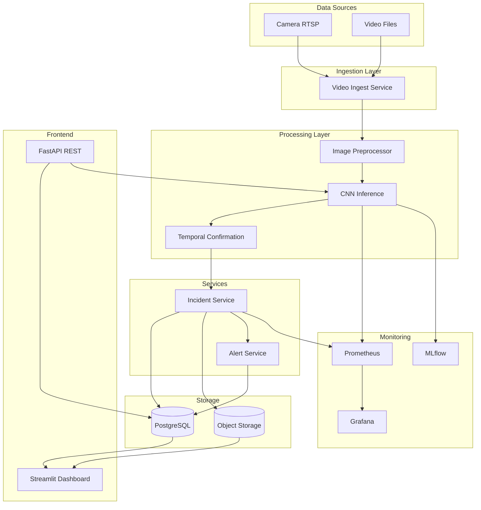

# 🏗️ KIẾN TRÚC HỆ THỐNG PHÁT HIỆN SỰ CỐ GIAO THÔNG

## 📋 TỔNG QUAN

Tài liệu này mô tả kiến trúc hệ thống phát hiện sự cố giao thông, bao gồm data flow, components, và các điểm tối ưu latency.

---

## 🔄 PIPELINE TỔNG QUAN

```
┌─────────────────┐
│  Data Sources   │
│  (Camera/Video) │
└────────┬────────┘
         │
         ▼
┌─────────────────┐
│   Ingest Layer  │
│  (Video Stream)  │
└────────┬────────┘
         │
         ▼
┌─────────────────┐
│  Preprocessing   │
│  (Image/Frame)  │
└────────┬────────┘
         │
         ▼
┌─────────────────┐
│  Inference      │
│  (CNN Model)    │
└────────┬────────┘
         │
         ▼
┌─────────────────┐
│ Temporal        │
│ Confirmation    │
└────────┬────────┘
         │
         ▼
┌─────────────────┐
│ Incident Service│
│ (Event Creation)│
└────────┬────────┘
         │
         ▼
┌─────────────────┐
│  Alert Service  │
│  (Notifications)│
└────────┬────────┘
         │
         ▼
┌─────────────────┐
│   Storage       │
│  (DB + Object)  │
└────────┬────────┘
         │
         ▼
┌─────────────────┐
│   Dashboard     │
│  (Streamlit)    │
└─────────────────┘
```

---

## 📊 KIẾN TRÚC CHI TIẾT

### 1. Data Ingestion Layer

**Component**: Video/Camera Stream Ingest

**Input**:
- RTSP stream từ camera
- Video files (MP4, AVI)
- Image files (JPG, PNG)

**Output**:
- Frames (numpy arrays, 224x224x3)
- Metadata (timestamp, camera_id, frame_number)

**Data Contract**:
```python
FrameData = {
    "frame": np.ndarray,  # Shape: (224, 224, 3)
    "timestamp": float,    # Unix timestamp
    "camera_id": str,     # Camera identifier
    "frame_number": int   # Frame sequence number
}
```

**Technology**: OpenCV, FFmpeg

---

### 2. Preprocessing Layer

**Component**: Image Preprocessor

**Functions**:
- Resize to 224x224
- Normalize (0-1 range)
- Data augmentation (training only)

**Output**: Preprocessed frame ready for inference

**Latency**: ~5-10ms per frame

---

### 3. Inference Layer

**Component**: CNN Model Inference

**Model**: MobileNetV2-based CNN

**Input**: Preprocessed frame (224x224x3)

**Output**: Probability (0-1)

**Latency**: 
- CPU: ~200-300ms
- GPU: ~20-50ms
- Edge (TensorRT): ~10-20ms

**Optimization**:
- Batch processing (32 frames)
- Model quantization (INT8)
- TensorRT optimization

---

### 4. Temporal Confirmation Layer

**Component**: Temporal Confirmation Module

**Input**: Stream of probabilities `[p_1, p_2, ..., p_t]`

**Methods**:
1. K-frames confirmation
2. Moving average window
3. Cooldown period

**Output**: Incident events (detected/confirmed/false_alarm)

**Latency**: ~1-2ms per frame (in-memory processing)

**Data Contract**:
```python
IncidentEvent = {
    "status": "detected" | "confirmed" | "false_alarm" | "resolved",
    "start_frame": int,
    "end_frame": int,
    "start_timestamp": float,
    "max_probability": float,
    "avg_probability": float,
    "confirmation_method": str
}
```

---

### 5. Incident Service

**Component**: Incident Management Service

**Functions**:
- Create incident records
- Link with media files
- Update status (confirmed/false_alarm/resolved)

**Data Contract**:
```python
Incident = {
    "id": int,
    "timestamp": datetime,
    "camera_id": str,
    "confidence_score": float,
    "model_version": str,
    "status": str,
    "image_path": str,
    "metadata": dict
}
```

**Storage**: PostgreSQL (incidents table)

---

### 6. Alert Service

**Component**: Alert/Notification Service

**Functions**:
- Send alerts (email, SMS, push notification)
- Webhook integration
- Dashboard notifications

**Channels**:
- Email (SMTP)
- SMS (Twilio, AWS SNS)
- Push (Firebase, APNS)
- Webhook (HTTP POST)

**Data Contract**:
```python
Alert = {
    "incident_id": int,
    "alert_type": "email" | "sms" | "push" | "webhook",
    "recipient": str,
    "title": str,
    "message": str
}
```

---

### 7. Storage Layer

#### 7.1. Database (PostgreSQL)

**Tables**:
- `incidents`: Incident records
- `predictions`: All predictions (for audit)
- `model_runs`: Training runs
- `alerts`: Alert history
- `incident_media`: Media file metadata

**Indexes**:
- `incidents(timestamp, camera_id)`
- `incidents(status, timestamp)`
- `predictions(timestamp, camera_id)`

**Partitioning**: By month (for large-scale)

#### 7.2. Object Storage

**Options**:
- Local filesystem (development)
- AWS S3 (production)
- Google Cloud Storage (production)

**Structure**:
```
s3://bucket/
├── incidents/
│   ├── 2024/
│   │   ├── 01/
│   │   │   ├── incident_001_image.jpg
│   │   │   └── incident_001_video.mp4
```

**Signed URLs**: Generate temporary URLs for media access

---

### 8. Dashboard Layer

**Component**: Streamlit Dashboard

**Features**:
- Real-time incident feed
- Incident details (image, video, metadata)
- Confirm/false_alarm actions
- Analytics (FAR, Recall, MTTD)
- Model performance metrics

**Data Source**: PostgreSQL + Object Storage

---

## 🔍 MONITORING & LOGGING

### 1. Metrics Collection (Prometheus)

**Metrics**:
- `incident_detection_latency_ms`: Histogram
- `incident_detection_rate`: Counter
- `false_alarm_rate`: Gauge
- `model_inference_latency_ms`: Histogram
- `predictions_total`: Counter

**Exported at**: `/metrics` endpoint

### 2. Logging

**Format**: JSON structured logs

**Levels**: INFO, WARNING, ERROR

**Fields**:
- `timestamp`
- `level`
- `component`
- `message`
- `metadata` (JSON)

**Storage**: 
- Local files (development)
- CloudWatch / Stackdriver (production)

### 3. MLflow Tracking

**Tracked**:
- Model versions
- Training metrics
- Hyperparameters
- Artifacts (plots, models)

**UI**: `http://localhost:5000`

---

## ⚡ ĐIỂM NGHẼN LATENCY VÀ CÁCH TỐI ƯU

### 1. Inference Latency

**Vấn đề**: CNN inference chậm trên CPU

**Giải pháp**:
- ✅ Batch processing (32 frames)
- ✅ Model quantization (INT8)
- ✅ TensorRT optimization
- ✅ GPU acceleration
- ✅ Edge deployment (Jetson, Coral)

**Target**: p95 latency ≤ 200ms

### 2. Database Write Latency

**Vấn đề**: Ghi vào PostgreSQL chậm

**Giải pháp**:
- ✅ Async writes (background tasks)
- ✅ Batch inserts
- ✅ Connection pooling
- ✅ Write-ahead logging (WAL)

**Target**: Write latency ≤ 50ms

### 3. Media Upload Latency

**Vấn đề**: Upload ảnh/video lên S3 chậm

**Giải pháp**:
- ✅ Async uploads (background)
- ✅ Compression (JPEG quality, video encoding)
- ✅ CDN caching
- ✅ Direct S3 upload (presigned URLs)

**Target**: Upload latency ≤ 500ms

### 4. Temporal Confirmation Latency

**Vấn đề**: Processing stream probabilities

**Giải pháp**:
- ✅ In-memory processing (numpy)
- ✅ Sliding window optimization
- ✅ Vectorized operations

**Target**: Processing latency ≤ 2ms per frame

---

## 🔐 SECURITY & AUTHENTICATION

### 1. API Authentication

**Method**: JWT tokens

**Endpoints**:
- `/api/v1/predict` (requires token)
- `/api/v1/incidents` (requires token)

### 2. Data Encryption

- **At rest**: Database encryption, S3 encryption
- **In transit**: HTTPS/TLS

### 3. Access Control

- Role-based access control (RBAC)
- Camera-level permissions

---

## 📈 SCALABILITY

### 1. Horizontal Scaling

**Components**:
- API servers (FastAPI, multiple instances)
- Inference workers (separate from API)
- Database (read replicas)

**Load Balancer**: Nginx, AWS ALB

### 2. Queue System (Future)

**Technology**: RabbitMQ, Kafka

**Use Cases**:
- Async inference
- Batch processing
- Event streaming

---

## 🚀 DEPLOYMENT

### 1. Development

```bash
# Local
python run_streamlit.py
python start_api.py
```

### 2. Production

**Containerization**: Docker

**Orchestration**: Kubernetes

**Services**:
- API: FastAPI (4 replicas)
- Dashboard: Streamlit (2 replicas)
- Database: PostgreSQL (managed service)
- Storage: S3/GCS

---

## 📊 ARCHITECTURE DIAGRAM (Mermaid)



---

## 📝 DATA CONTRACTS SUMMARY

| Component | Input | Output |
|-----------|-------|--------|
| **Ingest** | RTSP stream / Video file | FrameData |
| **Preprocess** | FrameData | Preprocessed frame (224x224x3) |
| **Inference** | Preprocessed frame | Probability (0-1) |
| **Temporal** | Stream of probabilities | IncidentEvent |
| **Incident Service** | IncidentEvent | Incident record (DB) |
| **Alert Service** | Incident record | Alert (email/SMS/push) |

---

*Tài liệu này mô tả kiến trúc hệ thống ở mức high-level. Chi tiết implementation xem trong source code.*

*Cập nhật lần cuối: [Ngày hiện tại]*

